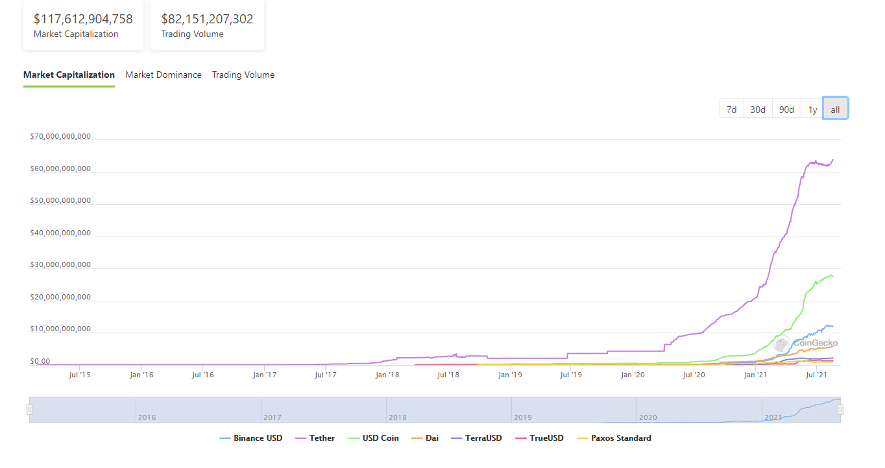

# Circle (Creator of USDC stablecoin) Case Study

## Overview and Origin
This case study is on the company Circle and around its main product, the USDC stable coin, for which it is most widely known for.
Circle was founded in October 2013, by Jeremy Allaire and Sean Neville, and began as a consumer peer-to-peer cryptocurrency payments and exchange platform.
The company stopped offering its cryptocurrency wallet services in 2016 and announced that the Circle Pay mobile and related web apps would be discontinued in 2019.
In 2020, the company stated that its focus will be on its USDC stablecoin, which is the main topic of interest for this case study.

Circle has received $270 million in venture backing from investors including Accel Partners, Bitmain, Blockchain Capital, Breyer Capital, CICC Alpha, China Everbright Bank, Digital Currency Group, General Catalyst, IDG Capital, and Pantera. 

The idea of a stablecoin arose with the rise of cryptocurrency trading. As many cryptocurrencies have volitile price flucuations, having a cryptocurrency that remains stable relative to a fiat currency is desirable for trading and holding purposes. USDC is the largest stablecoin that is regulated and claims to be "backed by fully reserved assets, redeemable on a 1:1 basis for US dollars". 

## Business Activities:
The company's main focus is the enablement for "businesses of all sizes to harness the power of digital currencies and public blockchains for payments, commerce and financial applications worldwide". It provides payment and accounting systems to integrate the use of USDC stablecoin to applications and charges a subscription fee for processing transactions which is comparable to companies such as PayPal, Stripe, or other payment gateways that work with fiat currencies.
The unique advantage of Circle's payment system and USDC is lower transaction fees since the USDC stablecoin runs on top of decentralized blockchain technlogies (Ethereum, Tron, Algorand, and Solana) and can bypass traditional banking transfer systems such as the international transfer system SWIFT, which is slow and costly. The transaction fee is not nil however, as the blockchain solutions usually charge a "gas" fee to compensate miners and other stakeholders of the system (in the case of Ethereum for example). Speed is also an advantage of USDC as the transaction time is usually only a few seconds to a few minutes depending on the underlying blockchain technology. SWIFT usually takes several days and so does other legacy interbank transfer channels used in the United States.

According to the Circle website, USDC is available as Ethereum ERC-20,  Algorand ASA, Solana SPL, and TRON TRC-20 tokens and supports smart contracts.
According to an article on coindesk.com, 61% of USDC tokens are backed by “cash and cash equivalents”, 13% by term deposits in non-US banks, 12% by U.S. treasuries accounts and 9% by commercial paper accounts, and the remaining tokens are backed by municipal and corporate bonds.

As a programmable digital currency with smart contracts functionality, it's main advantage compared to fiat currency is the low barrier to entry for companies or individuals who wish to build financial applications that use USDC. Creating financial applications in the past required government licenses and regulatory oversight and was only available to large institutions with huge resources. However Circle and USDC enables a more open market for new players to get involved.

## Landscape:
Circle and USDC are competing in a wide variety of areas within the finiancial industry including payment gateways, transfer systems, banking institutions, and even fiat currencies themselves. 
Other large noticable stable coins include USDT (Tether), BUSD (Binance USD), and DAI (a decentralised stablecoin).
USDT is actually the stablecoin with the largest market cap ($64 billion USD as of 18/08/2021) but some have doubts as to whether the stablecoin is fully backed by its equivalent in assets. Therefore it has been deemed more risky than USDC which has greater compliance with regulations and authorities. BUSD is issued by Binance and has a market cap of $12 billion USD (as of 18/08/2021) and was created mainly to facilitate trade on its widely popular crypto-trading platform, which is the largest in the world. DAI is the only fully decentralized stablecoin out of the four mentioned in this case study. DAI is maintained and regulated by MakerDAO which is a decentralised autonomous organisation (DAO) and is backed by the collateral assets in smart constracts held by MakerDao.
A major trend that highlights the influence of stablecoins is the fact that many reserve banks around the world have started to investigate the use of, or have implemented trials of central bank digital currencies (CBDCs), while the adoption of USDC by both Visa and Mastercard to settle payments has really boosted the legitamacy of USDC.

## Results
Being a regulated stablecoin and one that has played by the rules, it has been recognized for its legitamacy and even Mastercard and Visa, two giant's in the space and arguably also competitors to Circle and USDC, have agreed to use USDC to settle payments.
According to the Circle website, there is $27.4 billion USDC in circluation (as of 16th Aug 2021) and $968 billion USD in "transferred on-chain total". This speaks to the scale of use of USDC and its continued growth in circulation (market cap) shown in the table below points to its success.

## Recommendations
Some advise for the company I would give would include onboarding large retailers to accept USDC as a means of payment as this will increase the adoption of USDC by everyday people. The technology for this to happen already exists but the challenge is to make it user-friendly and accessible by all. I believe that marketing will be a crucial component in its implementation and the buy-now-pay-later companies have provided the perfect playbook for Circle to popularise this new form of payment method.

#Source
1. https://www.circle.com/
2. https://www.investopedia.com/terms/c/circle-financial-services-company.asp
3. https://www.coindesk.com/circle-reveals-assets-backing-usdc-stablecoin
4. https://www.coingecko.com/en/stablecoins
5. https://makerdao.com/en/
